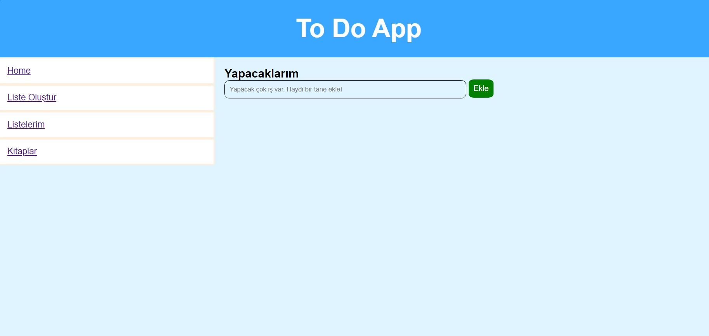

# todo-uygulama reposu

Bu repo todo uygulamasını içermektedir. Henüz bitmiş bir proje değildir. Bu proje HTML temelleri,CSS layoutları ve Javascript algoritmaları içermektedir. Eğitim amaçlı oluşturulmuştur. Son haline geldiğinde site canlıya alınacaktır. Kodları indirerek inceleyebilir, kendinize göre uyarlayabilirsiniz.



## Installation

Öncelikle projeyi clonelayın.(Buraya sizin reponuzdan aldığınız link gelecek)

```bash
git clone https://github.com/OmerGokalp/todo-uygulama.git
```

## Usage

Projeyi cloneladıktan sonra Visual Studio Code programında açınız.

Linux için:
```linux
cd todo-uygulama
code .
```

## Contributing
Pull requestler kabul edilir. Büyük değişiklikler için, lütfen önce neyi değiştirmek istediğinizi tartışmak için bir konu açınız.


## License
[MIT](https://choosealicense.com/licenses/mit/)
